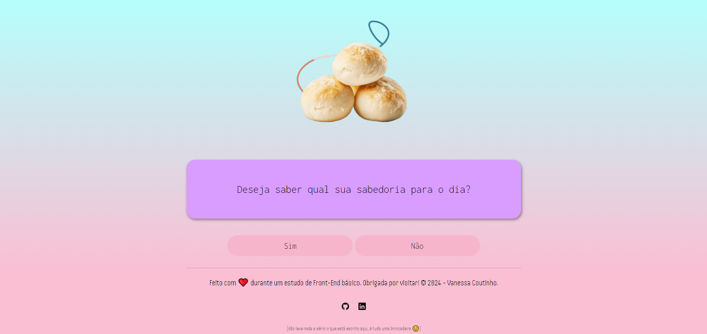
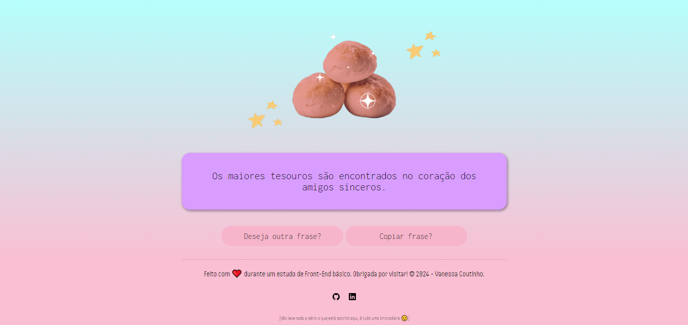
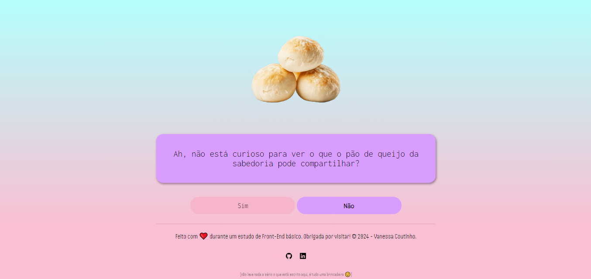

<h1 align="center">Projeto - Pão de Queijo da Sabedoria</h1>

Este projeto foi criado de forma a estudar alguns conceitos básicos de HTML, CSS e JavaScript. Nele, o usuário encontrará uma interatividade básica envolvendo botões, responsáveis por gatilhar ações como gerar frases aleatórias, copiar as frases geradas e recarregar a página. Foi feita a responsividade da página para dispositivos móveis, mas esta ainda pode apresentar pequenos problemas que eventualmente serão solucionados e o projeto aprimorado. 

<h2 align="center">Capturas de tela:</h2>

</a>
</a>
</a>

 